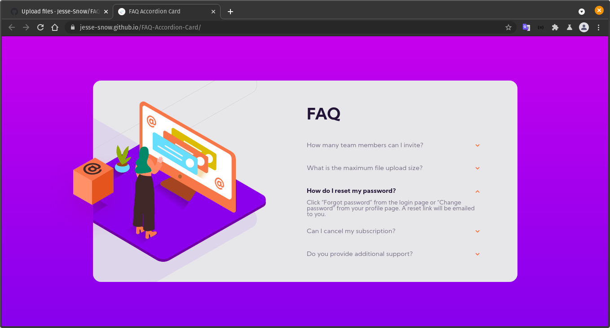

# Frontend Mentor - FAQ accordion card solution

This is a solution to the [FAQ accordion card challenge on Frontend Mentor](https://www.frontendmentor.io/challenges/faq-accordion-card-XlyjD0Oam). Frontend Mentor challenges help you improve your coding skills by building realistic projects. 

## Table of contents

- [Overview](#overview)
  - [The challenge](#the-challenge)
  - [Screenshot](#screenshot)
  - [Links](#links)
- [My process](#my-process)
  - [Built with](#built-with)
  - [What I learned](#what-i-learned)
  - [Continued development](#continued-development)
- [Author](#author)

## Overview

### The challenge

Users should be able to:

- View the optimal layout for the component depending on their device's screen size
- See hover states for all interactive elements on the page
- Hide/Show the answer to a question when the question is clicked

### Screenshot

### Links

- [Preview]:(https://jesse-snow.github.io/FAQ-Accordion-Card/)

## My process

### Built with

- HTML5 markup
- CSS custom properties
- Flexbox
- Deskotp-first Workflow

### What I learned

- How to control the position of backgorund-images;
- How to put more than one background-images;
- How to center verticaly in the Page;
- How to put HEIGHT on background-images;
- What is float property;
- Can combine pseudo-class and pseudo-elements;
- What is the attribute selector;

### Continued development

Know more how to set height and widhts in more responsive way.

## Author

- GitHub - [Jesse-Snow](https://github.com/Jesse-Snow)
